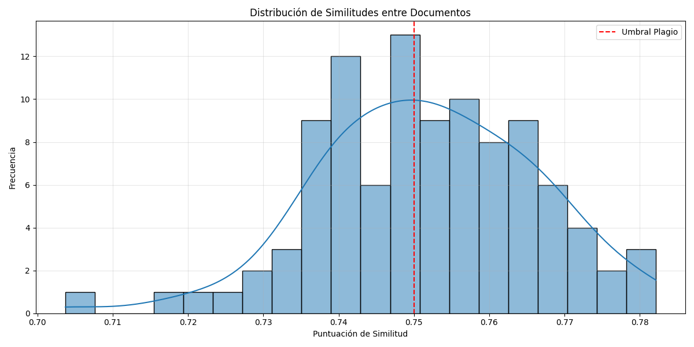
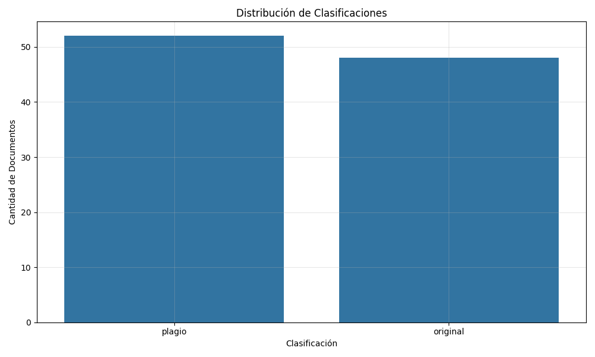
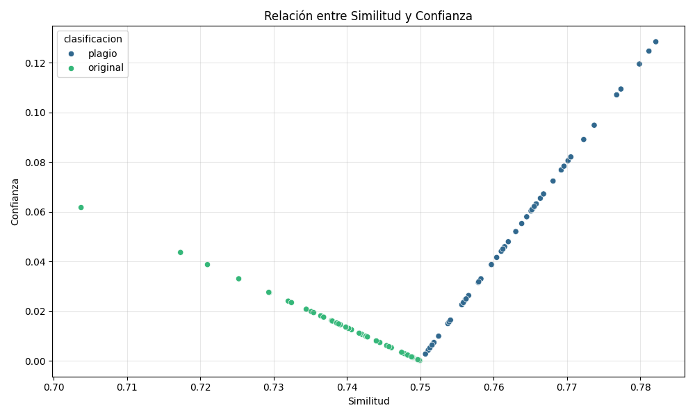

# Detección de Plagio mediante Embeddings Semánticos con BERT

Este trabajo fue realizado por un equipo de tres personas, cada una explorando diferentes modelos de embeddings. Esta documentación se centra en los resultados obtenidos utilizando el modelo BERT.

## Introducción

- Para esta version se exploro **BERT (Bidirectional Encoder Representations from Transformers):** BERT es un modelo de transformador pre-entrenado en una gran cantidad de texto y código. Su arquitectura permite aprender representaciones contextualizadas de las palabras, lo que significa que la representación de una palabra depende de las palabras que la rodean. Utiliza un mecanismo de autoatención para ponderar la importancia de diferentes palabras en el contexto, capturando así relaciones semánticas complejas.

## Metodología

### Selección de Datos

Para el desarrollo y evaluación de este modelo de detección de plagio, se seleccionó el conjunto de datos "Dokumen Teks", disponible públicamente en Kaggle ([Plagiarism Document Text](https://www.kaggle.com/datasets/fajarpanaungi/plagiarism-document-text)). La elección de este dataset se fundamentó en varios factores clave que lo hacen adecuado para la exploración y evaluación de modelos de detección de plagio basados en la similitud semántica:

1.  **Estructura Clara y Propósito Específico:** El dataset está organizado en dos carpetas principales: "Original", que contiene documentos fuente, y "Copy", que alberga documentos que son modificaciones o copias de los originales. Esta estructura facilita la creación de pares comparables (original vs. sospechoso), lo cual es esencial para entrenar y evaluar un modelo diseñado para identificar relaciones de similitud y potencial plagio entre textos específicos.

2.  **Simulación de Escenarios de Plagio:** Los documentos en la carpeta "Copy" fueron creados para simular diversos escenarios de plagio, incluyendo la copia directa, la paráfrasis y la sustitución de palabras. Esto permite evaluar la robustez del modelo ante diferentes estrategias de manipulación textual.

3.  **Disponibilidad Pública y Accesibilidad:** Al ser un dataset público en Kaggle, garantiza la transparencia y la reproducibilidad de la investigación.

4.  **Tamaño Adecuado para la Exploración:** El tamaño del dataset (100 pares de documentos) es manejable para las etapas iniciales de desarrollo y experimentación, permitiendo realizar pruebas iterativas y analizar los resultados con relativa rapidez.

En resumen, la selección del dataset "Dokumen Teks" se basó en su estructura organizada, su capacidad para simular escenarios de plagio, su accesibilidad pública y su relevancia para la tarea de detección de plagio en textos. 

### Análisis de Datos

El análisis de los datos se realizó mediante las siguientes técnicas:

1.  **Preprocesamiento textual**:

    - Normalización de espacios
    - Eliminación de caracteres especiales (conservando alfanuméricos y espacios)
    - Conversión a minúsculas

2.  **Análisis exploratorio**:

    - Evaluación de la longitud de los textos para entender la variabilidad en el dataset.
    - Identificación de patrones comunes entre textos con alta similitud (e.g., secuencias de palabras idénticas).
    - Análisis de la distribución de palabras para identificar vocabulario clave y posibles sinónimos utilizados en las copias.

3.  **Herramientas utilizadas**:
    - Python como lenguaje principal para el desarrollo y análisis.
    - Bibliotecas: NumPy para operaciones numéricas, Pandas para la manipulación y análisis de datos tabulares.
    - Matplotlib y Seaborn para la creación de visualizaciones que ayuden a entender la distribución de los datos y los resultados.
    - TensorFlow y TensorFlow Hub para la integración y uso del modelo de embeddings semánticos.

El análisis exploratorio reveló que los textos clasificados con alta similitud a menudo conservan fragmentos extensos del texto original. Los textos con similitud media presentan una mayor variación, incluyendo parafraseo y sustitución de palabras, manteniendo sin embargo el significado central. Los textos con baja similitud generalmente abordan el mismo tema pero con un contenido y una estructura significativamente diferentes.

### Construcción del Modelo

1.  **Selección del modelo de embeddings**:

    - Se eligió el **Bidirectional Encoder Representations from Transformers(BERT)**.

2.  **Implementación del pipeline de procesamiento**:

    - Carga de pares de archivos (original y sospechoso) desde las carpetas "Original" y "Copy" del dataset "Dokumen Teks", emparejándolos por un identificador común en sus nombres de archivo.
    - Preprocesamiento de textos utilizando la función `preprocess_text` para normalizar espacios, eliminar caracteres no alfanuméricos y convertir el texto a minúsculas, lo que ayuda a enfocar el análisis en el contenido semántico.
    - Generación de embeddings semánticos para cada texto del par utilizando la función `obtener_embeddings_semanticos`, la cual carga el modelo BERT y aplica la transformación a los textos preprocesados.
    - Cálculo de la similitud coseno entre los vectores de embeddings del par de textos utilizando la función `cosine_similarity` de scikit-learn. Esta métrica proporciona una medida de la similitud en el espacio vectorial de los embeddings.
    - Clasificación del resultado basada en los umbrales definidos en la configuración (`CONFIG['similitud']['umbral_plagio'] = 0.75`) utilizando la función `clasificar_similitud`.

3.  **Definición de umbrales y clasificación**:
    Se establecieron los siguientes umbrales para clasificar la similitud entre un texto original y uno sospechoso, basados en la literatura revisada que sugiere umbrales altos para indicar plagio de manera fiable:

    - **Plagio**: Similitud coseno ≥ 0.75
    - **Original**: Similitud coseno < 0.75
      Además, se calcula un nivel de confianza para cada clasificación, indicando qué tan lejos o cerca está la similitud del umbral de plagio. La confianza para la clasificación de plagio se calcula como `(sim - umbral) / (1 - umbral)`, y para la clasificación de original como `1 - (sim / umbral)`.

## Resultados

### Presentación de Hallazgos

Es importante destacar que, debido a que el dataset "Dokumen Teks" no proporciona etiquetas definitivas que indiquen si cada par de documentos constituye plagio, sospecha o es original (es decir, no contamos con el "ground truth"), no es posible utilizar métricas de clasificación supervisada tradicionales como la precisión (accuracy), el F1-score o el recall. Estas métricas requieren conocer las etiquetas verdaderas para evaluar el rendimiento del modelo al predecir dichas etiquetas.

Al no disponer de estas etiquetas, recurrimos a **métricas de clustering** como el Silhouette Coefficient, la Pureza del Cluster y la Ganancia de Información. Estas métricas evalúan la estructura inherente de los datos en el espacio de características (en este caso, la similitud y la confianza calculadas por el modelo) y la calidad de la agrupación de los documentos según estas características. Un buen clustering, aunque no se compare directamente con una verdad conocida, puede indicar que el modelo está encontrando patrones significativos en los datos que podrían corresponder a diferentes niveles de similitud o potencial plagio.

- **Métricas de Clustering:** Estas métricas evalúan la calidad de la agrupación de los datos en función de su similitud y confianza.
  - **Silhouette Coefficient:** Mide qué tan similar es un objeto a su propio cluster en comparación con otros clusters. Valores cercanos a +1 indican que el objeto está bien agrupado, valores cercanos a 0 indican que el objeto está cerca del límite de decisión entre dos clusters, y valores negativos indican que el objeto esta mal agrupado.
  - **Pureza del Cluster (K-means):** Evalúa la proporción de documentos en cada cluster que pertenecen a la misma clase (plagio u original). Una pureza alta sugiere que los clusters capturan bien las categorías reales.
  - **Ganancia de Información:** Cuantifica la reducción en la incertidumbre sobre la clase (plagio u original) después de conocer la asignación de los documentos a los clusters. Una ganancia alta indica que el clustering proporciona información útil para la clasificación.

Resultados BERT

- **Métricas de Clustering:**

  - **Silhouette Coefficient:** El valor obtenido fue de 0.367.
  - **Pureza del Cluster (K-means):** Se alcanzó una pureza de 0.74.
  - **Ganancia de Información:** La ganancia de información fue de 0.213.

- **Visualizaciones:**
  - **Histograma de distribución de similitudes:** El histograma muestra una distribución centrada alrededor de 0.75, con una cantidad notable de valores cerca del umbral.
    
  - **Gráfico de barras por clasificación:** Se observó una distribución casi equitativa entre las clases de plagio (52 documentos) y original (48 documentos).
    
  - **Scatter plot de similitud vs confianza:** El scatter plot muestra una tendencia general donde los puntos clasificados como plagio tienden a tener valores de similitud y confianza más altos, aunque con cierta superposición.
    

Los resultados obtenidos con el modelo BERT nos dejan con una capacidad limitada para una separación clara entre los documentos originales y los que presentan plagio, dado el Silhouette Coefficient de 0.367. Este valor, relativamente bajo, indica que los documentos no están bien definidos dentro de sus respectivos clusters en el espacio de similitud y confianza, existiendo una considerable superposición entre ellos.

La Ganancia de Información de 0.213, aunque positiva, también sugiere que la estructura del clustering aporta una reducción modesta en la incertidumbre sobre la clasificación de los documentos. Esto implica que, si bien el clustering ofrece cierta información útil, no es un predictor fuerte de la clase (plagio/original).

El histograma de distribución de similitudes muestra una concentración notable de puntuaciones alrededor del umbral de 0.75, con una dispersión limitada hacia valores significativamente más altos o más bajos. Esta falta de dispersión nos dice que la mayoría de los pares de documentos tienen niveles de similitud muy cercanos al umbral de decisión, lo que dificulta una clasificación robusta basada únicamente en este valor.

En cuanto al logro de los objetivos, si bien se exploró la viabilidad de BERT para la detección de plagio, los resultados sugieren que, con la configuración actual (umbral y preprocesamiento básico), el modelo presenta limitaciones en la separación clara de las clases. Aunque se identificaron posibles casos de plagio, la calidad del clustering y la distribución de similitudes indican que no se logró una discriminación robusta en todos los casos.

Para la version mejorada de reto se comprara con los resultados de los modelos de mis compañeros usando la misma configuracion y poder analizar cual nos lleva a los mejores resultados.

## Conclusiones

En este estudio, se exploró la aplicación del modelo de embeddings semánticos BERT para la detección de plagio en el dataset "Dokumen Teks", utilizando un umbral de similitud coseno de 0.75 como criterio principal de clasificación. El análisis reveló que, si bien BERT es capaz de capturar similitudes semánticas entre documentos, su rendimiento en la tarea de distinción binaria entre plagio y original presenta limitaciones con la configuración actual.

Los principales hallazgos indican una concentración de puntuaciones de similitud alrededor del umbral establecido, lo que dificulta una clasificación inequívoca en muchos casos. Las métricas de clustering, con un Silhouette Coefficient de 0.367 y una Ganancia de Información de 0.213, sugieren una separación modesta entre los grupos implícitos de plagio y original, así como una utilidad limitada del clustering para predecir la clase. Estos resultados contribuyen al conocimiento existente al proporcionar una evaluación empírica del rendimiento de BERT en un contexto de detección de plagio con un umbral específico, resaltando la importancia de la calibración y la posible necesidad de enfoques complementarios.

Desde una perspectiva práctica, el estudio sugiere que si bien BERT puede identificar posibles casos de plagio, la cercanía de muchas puntuaciones al umbral requiere atencion pues es muy pequeño el rango en los resultados.

Las limitaciones del estudio incluyen su dependencia de un único dataset y un preprocesamiento básico. El umbral de similitud de 0.75 se seleccionó basándose en recomendaciones de la literatura para la detección de plagio con embeddings semánticos y se aplicó de manera uniforme a los diferentes modelos evaluados. Sin embargo, es posible que cada modelo de embedding tenga un umbral óptimo diferente para este dataset y para otros contextos. La ausencia de etiquetas definitivas de plagio en el dataset impide el cálculo de métricas de evaluación estándar como la precisión es por eso que se hizo uso de las metricas de Clustering, pues no tenemos las etiquetas de cada copy. Finalmente, el análisis se limitó a comparaciones uno a uno entre documentos originales y sospechosos, sin abordar la detección de plagio a partir de múltiples fuentes.

En resumen, este estudio proporciona una evaluación inicial del uso de BERT para la detección de plagio, identificando tanto su potencial como sus limitaciones con la configuración empleada. Los resultados obtenidos sientan las bases para el reto con una version mejorada que busquen refinar la metodología y comparar el rendimiento con otros modelos, con el objetivo final de desarrollar una herramienta de detección de plagio más robusta y precisa.
